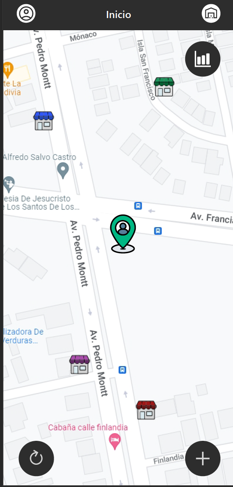
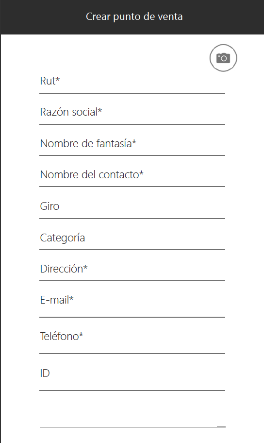
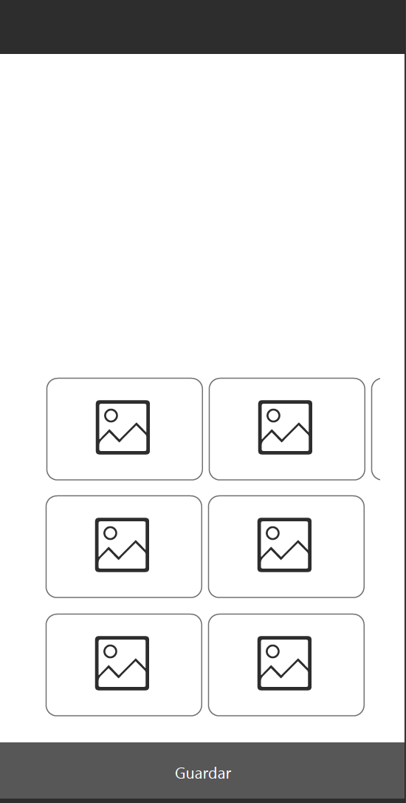
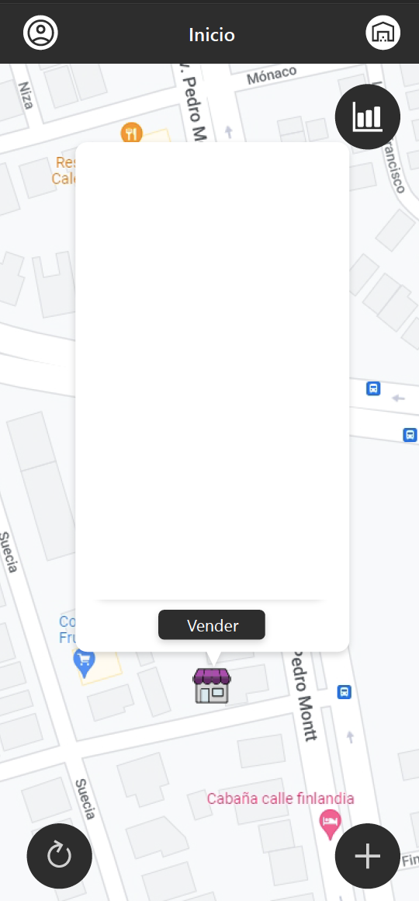

La base de datos está en firebase, pero se debe realizar. 
• Que cambios se necesitan hacer.
• Hacer la base de datos en firebase y vincularlo al proyecto.
• Probar la aplicación ya desarrollada.
.Login

• Pagina Principal visualizar un mapa de donde está el trabajador.

Ingresar un botón con el signo “+” para agregar un almacén.
Crear el almacén.

o Tomar una Foto del almacén
o Nombre * Obligatorio
o Rut * Ogligatorio
o Giro
o Nombre de Fantasía 
o Teléfono contacto o almacén Obligatorio
o Dirección * Obligatorio (Sumas puntos si la sacas desde googlemaps)
o Nombre del contacto del almacén
o E ingresar un ID del almacén.
Guardar, además datos que no deben ser solicitados, la fecha y hora con la que se crea el 
Almacén, esta no se debe pedir y que vendedor está utilizando el almacén.

• Este almacén debe aparecer en el mapa y debe quedar guardado en el cache o en 
una base de datos interna y en firebase
• Poder seleccionar el almacén y en el globo de texto ingresar un botón vender.

• En la pantalla de venta deben aparecer los datos del almacén seleccionar los 
productos que podemos vender y las cantidades. 

• Debe haber un botón para salir el cual debe guardar la fecha y hora de la salida del 
punto de venta